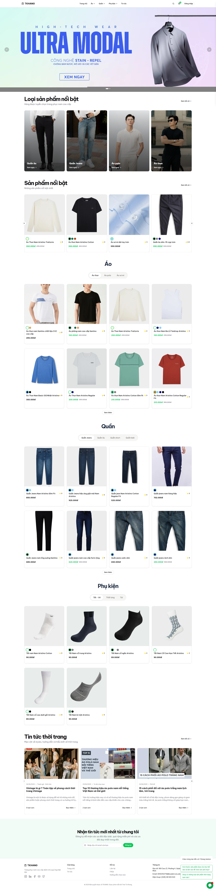

# 👔 TKhang - Website Thời Trang Nam

Website thương mại điện tử chuyên bán thời trang nam được xây dựng bằng Next.js, cung cấp trải nghiệm mua sắm hiện đại và thân thiện với người dùng. Xem backend của dự án [Tại đây](https://github.com/kinyias/tkhang-fashion-api)

Xem demo : [🚀 Xem bản demo](https://tkhang-fashion.vercel.app/)
## 🌟 Tính năng chính

### 🛍️ Tính năng người dùng

- **Danh mục sản phẩm đa dạng**: Áo sơ mi, quần tây, áo polo, phụ kiện nam
- **Tìm kiếm và lọc thông minh**: Tìm kiếm full-text-search, tìm kiếm theo từ đồng nghĩa , theo giá, size, màu sắc, thương hiệu
- **Giỏ hàng và thanh toán**: Tích hợp nhiều phương thức thanh toán (cod, momo, vnpay)
- **Tài khoản cá nhân**: Quản lý đơn hàng, địa chỉ, thông tin cá nhân
- **Đánh giá sản phẩm**: Hệ thống review và rating
- **Quản trị**: Trang quản trị đầy đủ thông tin dễ sử dụng và quản lý
- **Ứng dụng AI**: AI tự động tạo mô tả sản phẩm, tạo báo cáo phân tích, duyệt đánh giá tự động, gợi ý chọn size, chatbot.
- **Responsive design**: Tối ưu cho mọi thiết bị

### 🎨 Giao diện

- **UI/UX hiện đại**: Thiết kế clean, tối giản phù hợp thời trang nam
- **Animation mượt mà**: Micro-interactions tăng trải nghiệm
- **Loading skeleton**: Hiển thị placeholder khi tải dữ liệu

### ⚡ Hiệu năng

- **SSR/SSG**: Server-side rendering và Static site generation
- **Image optimization**: Tối ưu hình ảnh với Next.js Image

## 🛠️ Công nghệ sử dụng

### Frontend

- **Framework**: Next.js 15+ (App Router)
- **Language**: TypeScript
- **Styling**: Tailwind CSS / Styled Components
- **State Management**: Zustand
- **UI Library**: Shadcn/ui
- **Forms**: React Hook Form + Zod validation
- **HTTP Client**: Axios / Fetch API

### Authentication & Payments

- **Auth**: Google
- **Payments**: COD/ Vnpay / MoMo
- **Database**: PostgreSQL

### Tools & Libraries

- **Icons**: Lucide React / React Icons
- **Charts**: Recharts (cho admin dashboard)
- **Date**: date-fns
- **Linting**: ESLint + Prettier

## 🚀 Cài đặt và chạy dự án

### Yêu cầu hệ thống

- Node.js 22+
- npm/yarn/pnpm
- Git

### Cài đặt

1. **Clone repository**

```bash
git clone https://github.com/kinyias/Men-Fashion
cd Men-Fashion
```

2. **Cài đặt dependencies**

```bash
npm install
# hoặc
yarn install
# hoặc
pnpm install
```

3. **Cấu hình environment variables**

```bash
cp .env.example .env.local
```

Cập nhật các biến môi trường trong `.env.local`:

```env
#Backend API
NEXT_PUBLIC_API_BASE_URL=

#Gemini API key
NEXT_PUBLIC_GEMINI_API_KEY=

#UPLOADTHING_TOKEN
UPLOADTHING_TOKEN=

#Cloudinary
CLOUDINARY_CLOUD_NAME=
CLOUDINARY_API_KEY=
CLOUDINARY_API_SECRET=

#ViettelPost
NEXT_PUBLIC_VIETTEL_POST_URL=
NEXT_PUBLIC_VIETTEL_POST_USERNAME=
NEXT_PUBLIC_VIETTEL_POST_PASSWORD=
NEXT_PUBLIC_VIETTEL_POST_SENDER_DISTRICT=
NEXT_PUBLIC_VIETTEL_POST_SENDER_PROVINCE=
NEXT_PUBLIC_VIETTEL_POST_SENDER_WARD=
```

4. **Chạy development server**

```bash
npm run dev
# hoặc
yarn dev
# hoặc
pnpm dev
```

Mở [http://localhost:3000](http://localhost:3000) để xem website.

## 📝 Scripts có sẵn

```bash
npm run dev          # Chạy development server
npm run build        # Build production
npm run start        # Chạy production server
```

```

## 🚀 Deployment

### Vercel (Recommended)

1. Push code lên GitHub
2. Import project trong Vercel
3. Cấu hình environment variables
4. Deploy tự động

### Các platform khác

- **Netlify**: Hỗ trợ Next.js với Netlify Edge Functions
- **Railway**: Deploy với database tích hợp
- **DigitalOcean App Platform**: Container-based deployment


## 🔒 Security

- **HTTPS** bắt buộc trong production
- **CSP Headers** để ngăn XSS attacks
- **Rate limiting** cho API endpoints
- **Input validation** với Zod

## 📄 License

Dự án này được cấp phép dưới [MIT License](LICENSE).

## 📞 Liên hệ

- **Email**: kinyiasdev@gmail.com
- **Website**: https://tkhang-fashion.vercel.app
- **GitHub**: https://github.com/kinyias/Men-Fashion

---
